<!-- ============================ BANNER ============================ -->
<p align="center">
  
</p>

<!-- ============================ TYPING ============================ -->
<p align="center">
  
</p>

<!-- ============================ REDES ============================ -->
<p align="center">
  <a href="https://www.linkedin.com/in/miguel-neri-a427b3420/">
    
  </a>
  <a href="https://instagram.com/miguellssz_">
    
  </a>
  <a href="mailto:migasneri18@gmail.com">
    
  </a>
</p>

<br>

<!-- ============================ SOBRE ============================ -->
<h2 align="center">Sobre mim</h2>

<p align="center">
  Analista de dados em formação.<br>
  Converso com planilhas de orçamento público e, às vezes, elas respondem.
</p>

```python
class Miguel:
    formacao = "Estudante de Ciência de Dados"
    stack    = ["Python", "SQL", "SQLite", "Excel", "Power BI"]
    status   = "transformando planilha em informação"
```

<br>

<!-- ========================= TECNOLOGIAS ========================= -->
<h2 align="center">Tecnologias</h2>

<p align="center">
  
  
  
  
  
</p>

<br>

<!-- ========================== PROJETOS ========================== -->
<h2 align="center">Projetos</h2>

<p align="center">
  <a href="https://github.com/miguel-neri17/SEV">
    
  </a>
</p>

<p align="center">
  <b>SEV</b> — controle de estoque e análise de vendas para pequenos comércios.<br>
  <sub>Python · SQLite</sub>
</p>

<br>

<!-- =========================== GITHUB =========================== -->
<h2 align="center">GitHub</h2>

<p align="center">
  
  
</p>

<p align="center">
  
</p>

<p align="center">
  
</p>

<p align="center">
  
</p>

<p align="center">
  
</p>

<br>

<!-- =========================== RODAPÉ =========================== -->
<p align="center">
  <sub>Obrigado pela visita. Se chegou até aqui, a planilha já pode fechar.</sub>
</p>

<p align="center">
  
</p>
